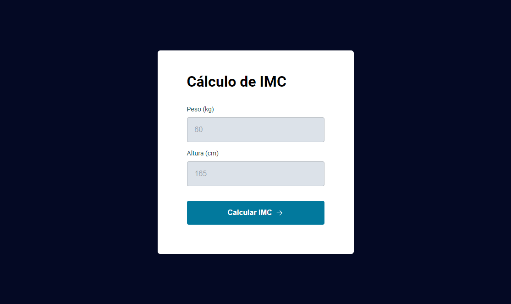

# Calculadora de IMC

> Explorer

Projeto desenvolvido na segunda parte do Stage 05, no programa Explorer da Rocketseat.

[🔗 Clique aqui para acessar](https://enzocauex.github.io/IMC/)

## 🛠️ Tecnologias

- HTML
- CSS
- JavaScript
- Git & Github
- Figma

## ⚙️ Conceitos aplicados
- HTML Semântico
- Responsividade
- Callback Function
- Condicionais
- Eventos
- Modularização
- ES6 Modules

## ☎️ Contato

[Instagram](https://instagram.com/enzocauex/)

[Linkedin](https://www.linkedin.com/in/enzo-caue/)